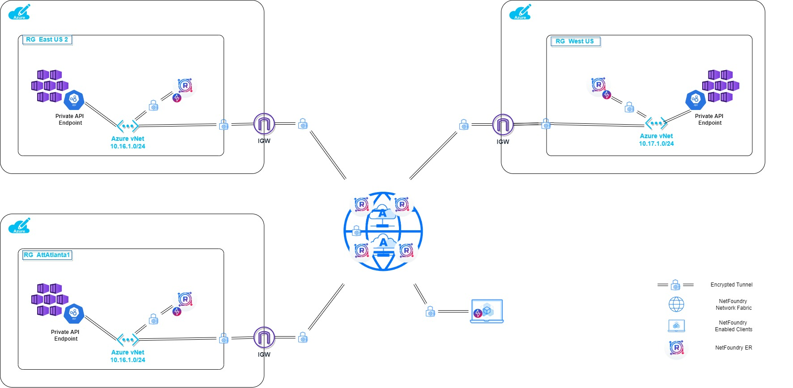

# NetFoundry Service Architecture for Multi Region Private AKS Deployment in Azure.



In this example deployment, we are showing how a user, i.e. network/cloud admin, devops engineer, app developer, etc, can access each individual AKS Cluster's Control Plane through Private API Endpoint with one Ziti Service.

A typical Ziti Service provide access to applications/services that can be highly distributed over more than one region. The load distribution is calculated at ingress to the network versus the egress based on the path latency, availability of a region, etc. It can also be tweaked to have a bias towards a region if needed. 

That works very well for most applications/services. Applications like VoIP that need to dial a certain destination or Orchestration Platforms need to access the control plane of the deployed infrastructure in a specific region need with a predictable service destination selection. In other words, these apps/service/users need an ability to reach an exact destination at any given time.  With a typical Ziti Service, one would need to configure a service per destination to always reach the same destination at any given time, not very practical or even scalable solution.

This is where addressable terminators come in. When a ziti service is hosted on an egress endpoint, it automatically creates so called service terminator(s). If terminators are marked with addressable identity, they can be addressed by the name of the endpoint (aka identity) that created them. There is also an option to use a special tag called appData instead of the name. In this guide, we will use the name of the endpoint, which is the edge router's name.

***
***Prerequisites***

[NetFoundry Network ](https://netfoundry.io/platform/) powered by [openziti](https://ziti.dev/) needs to be created and available along with API client_id and client_secret for the access to the NetFoundry Platform. The ARM template will need them to create an edge router on the network and retrieve the registration key for it. 
***

## Steps to create Azure Infrastructure in a desired region

Run the following to deploy a Private AKS cluster with one node and NF Edge Router into your Resource Group.  Set the required ENVIRONMENT VARIABLES before the command is run.
***
You may need to install azure cli and login first if not already done so.
***

### any Azure Region
```bash
az deployment group create --name daksdeploy$LOCATION --subscription $SUB_ID --resource-group $RG_NAME --template-file template.json --parameters parameters.json -p client_id=$CLIENT_ID -p client_secret=$CLIENT_SECRET -p router_attribute=<your router attribute> -p location=$LOCATION acrResourceGroup=$RG_NAME
```

### Public MEC Azure Region
```bash
az deployment group create --name daksdeploy$LOCATION --subscription $SUB_ID --resource-group $RG_NAME --template-file template-edge-zones.json --parameters parameters.json -p client_id=$CLIENT_ID -p client_secret=$CLIENT_SECRET -p router_attribute=<your router attribute> -p location=$LOCATION -p acrResourceGroup=$RG_NAME
```
### Configure Zit Service
Assumtions: edge router policy, appwan (aka service policy), etc are configured.

NF Console

1. Select Advanced Configuration Service Tile (i.e. Configs)
2. Paste the following code into the intercept.v1 config section with your own fqdns
```json
{
  "addresses": [
    "dkube-b0b29d67.90a6aecb-1cb3-4c87-ab12-2905ad87ffe7.privatelink.westus.azmk8s.io",
    "dkube-db284148.10d84ef8-be30-4cb0-9dc8-a7b1abe22430.privatelink.eastus2.azmk8s.io"
  ],
  "protocols": [
    "tcp"
  ],
  "portRanges": [
    {
      "low": 443,
      "high": 443
    }
  ],
  "dialOptions": {
    "identity": "$dst_hostname"
  }
}

```
3. Paste the following code into the host.v1 config section with your own fqdns
```json
{
  "forwardPort": true,
  "listenOptions": {
    "identity": "$tunneler_id.name"
  },
  "forwardAddress": true,
  "forwardProtocol": true,
  "allowedAddresses": [
    "dkube-b0b29d67.90a6aecb-1cb3-4c87-ab12-2905ad87ffe7.privatelink.westus.azmk8s.io",
    "dkube-db284148.10d84ef8-be30-4cb0-9dc8-a7b1abe22430.privatelink.eastus2.azmk8s.io"
  ],
  "allowedProtocols": [
    "tcp"
  ],
  "allowedPortRanges": [
    {
      "low": 443,
      "high": 443
    }
  ]
}
```
### openziti cli ###
Need to create configs files from the json configs shown above under the NF Console Section (i.e. intercept.v1 and host.v1 types) first.
```bash
ziti edge create config <your intercept config name> intercept.v1 --json-file intercept_v1.json
ziti edge create config <your host config name> host.v1 --json-file host_v1.json 
```
And then attach them them to a service as shown.
```bash
ziti edge create service <your service name> --configs <your intercept config name>,<your host config name> --role-attributes <your service attribute name>
```
Finally, this service needs to be assigned to endpoints that will be hosting it. 
***
Note: identity-roles need to match the attribute passed as a command input above in the infrastructure creation step.
***
```
ziti edge create service-policy <your service name> Bind --identity-roles <your router attribute> --service-roles <your service attribute name>
```

### Test the controller plane access
**Connect to the cluster**

To manage a Kubernetes cluster, use the Kubernetes command-line client, kubectl. kubectl is already installed if you use Azure Cloud Shell.

1. Install kubectl locally using the az aks install-cli command:

**Azure CLI**

```bash
az aks install-cli
```

2. Configure kubectl to connect to your Kubernetes cluster using the az aks get-credentials command. The following command:

* Downloads credentials and configures the Kubernetes CLI to use them.
* Uses ~/.kube/config, the default location for the Kubernetes configuration file. Specify a different location for your Kubernetes configuration file using --file argument.
```bash
az aks get-credentials --resource-group $RG_NAME --name {myAKSCluster} --subscription $SUB_ID
```

3. Verify the connection to your cluster using the kubectl get command. This command returns a list of the cluster nodes.
```bash
kubectl get nodes
```

The following output example shows the single node created in the previous steps. Make sure the node status is Ready:
```bash
NAME                       STATUS   ROLES   AGE     VERSION
aks-nodepool1-31718369-0   Ready    agent   6m44s   v1.12.8
```


Delete Deployment
```bash
az deployment group delete --name daksdeploywestus --subscription $SUB_ID   --resource-group $RG_NAME
az deployment group delete --name daksdeployeastus2 --subscription $SUB_ID   --resource-group $RG_NAME
```

Deploy test container - nginx
```bash
kubectl apply -f nginx-manifest.yaml
```
Deploy identity for NF Tunnel App
```bash
kubectl create secret generic ziti-enrolled-identity --from-file=ziti-enrolled-identity=./myZitiIdentityFile.json
```
Deploy zet container
```bash
kubectl apply -f zet-manifest.yaml
```
Check logs for zet
```bash
 kubectl logs -f zet-aks-eastus01{+assigned id} -c ziti-edge-tunnel
```
Log into to zet bash
```bash
kubectl exec -it zet-aks-eastus01{+assigned id} -- /bin/bash
```

## Deploy Ziti Embedded App and test the data a path across Ziti using both service types
Deploy identity for GRPC Server App
```bash
kubectl create secret generic grpc-echo-server-identity --from-file=grpc-echo-server-identity=./grpcServerdentityFile.json
```
Deploy grpc server app container
```bash
kubectl apply -f grpc-echo-app-manifest.yaml
```
Delete grpc server app container
```bash
kubectl delete deploy grpc-echo-app
```
More Kubectl syntax commands can be found at the following link.

[Kubectl Command Cheatsheet](https://kubernetes.io/docs/reference/kubectl/cheatsheet/)


List All Kube Contexts
```
kubectl config get-contexts
```

Switch to a given context
```
kubectl config use-context {Cluster_Name}
```

Delete Kube Context
```
kubectl config delete-context  {Cluster_Name}
```


