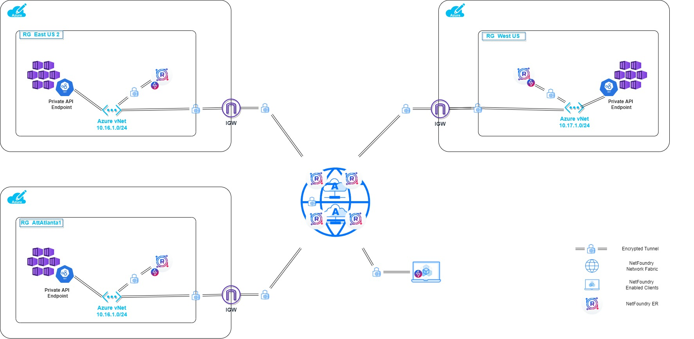
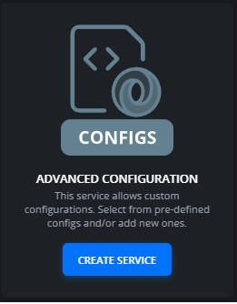

# NetFoundry Service Architecture for Multi Region Private AKS Deployment in Azure.



In this example deployment, we are showing how a user, i.e. network/cloud admin, devops engineer, app developer, etc, can access each individual AKS Cluster's Control Plane through Private API Endpoint with one Ziti Service.

A standard Ziti Service provides access to applications/services that can be highly distributed over more than one region. The load distribution is calculated at ingress to the network versus the egress based on the path latency, availability of a region, etc. It can also be tweaked to have a bias towards a region if needed. 

That works very well for most applications/services. Applications like VoIP that need to dial a certain destination or Orchestration Platforms need to access the control plane of the deployed infrastructure in a specific region need a predictable service destination selection. In other words, these apps/service/users need an ability to reach an exact destination at any given time.  With a standard Ziti Service, one would need to configure a service per destination to always reach the same destination at any given time, not very practical or even scalable solution.

This is where addressable terminators come in. When a ziti service is hosted on an endpoint, it automatically creates so called service terminator(s). If terminators are marked with addressable identity, they can be addressed by the name of the endpoint (aka identity) that is hosting the service. There is also an option to use a special tag called appData instead of the name. In this guide, we will use the name of the endpoint, which is the edge router's name.

***
***Prerequisites***

[NetFoundry Network ](https://netfoundry.io/platform/) powered by [openziti](https://ziti.dev/) needs to be created and available along with API client_id and client_secret for the access to the NetFoundry Platform. The ARM template will need them to create an edge router on the network and retrieve the registration key for it. 
***

>## Steps to create Azure Infrastructure in a desired region

Run through the following to deploy a Private AKS cluster with one node and NF Edge Router into your Resource Group.  Set the required ENVIRONMENT VARIABLES before the command is run.
***
You may need to install azure cli and login first if not already done so.
***

## Any Azure Region
```powershell
az deployment group create --name daksdeploy$LOCATION --subscription $SUB_ID --resource-group $RG_NAME --template-file template.json --parameters parameters.json -p client_id=$CLIENT_ID -p client_secret=$CLIENT_SECRET -p router_attribute=<your router attribute> -p location=$LOCATION acrResourceGroup=$RG_NAME
```

## Public MEC Azure Region
```powershell
az deployment group create --name daksdeploy$LOCATION --subscription $SUB_ID --resource-group $RG_NAME --template-file template-edge-zones.json --parameters parameters.json -p client_id=$CLIENT_ID -p client_secret=$CLIENT_SECRET -p router_attribute=<your router attribute> -p location=$LOCATION -p acrResourceGroup=$RG_NAME
```
>## Configure Ziti Service
***
<u>***Assumptions***</u>: an edge router policy is already configured.
***
## NF Console

1. Create a service using a guide at [Create and Manage Services](https://support.netfoundry.io/hc/en-us/articles/360045503311-Create-and-Manage-Services)
1. Select Advanced Configuration Service Tile (i.e. Configs) not found in the guide

    

1. Paste the following code into the intercept.v1 config section with your own fqdns
    ```json
    {
        "addresses": [
            "dkube-b0b29d67.90a6aecb-1cb3-4c87-ab12-2905ad87ffe7.privatelink.westus.azmk8s.io",
            "dkube-db284148.10d84ef8-be30-4cb0-9dc8-a7b1abe22430.privatelink.eastus2.azmk8s.io"
        ],
        "protocols": [
            "tcp"
        ],
        "portRanges": [
            {
            "low": 443,
            "high": 443
            }
        ],
        "dialOptions": {
            "identity": "$dst_hostname"
        }
    }

    ```
1. Paste the following code into the host.v1 config section with your own fqdns
    ```json
    {
        "forwardPort": true,
        "listenOptions": {
            "identity": "$tunneler_id.name"
        },
        "forwardAddress": true,
        "forwardProtocol": true,
        "allowedAddresses": [
            "dkube-b0b29d67.90a6aecb-1cb3-4c87-ab12-2905ad87ffe7.privatelink.westus.azmk8s.io",
            "dkube-db284148.10d84ef8-be30-4cb0-9dc8-a7b1abe22430.privatelink.eastus2.azmk8s.io"
        ],
        "allowedProtocols": [
            "tcp"
        ],
        "allowedPortRanges": [
            {
            "low": 443,
            "high": 443
            }
        ]
    }
    ```
1. Create AppWan and add the service along with the Edge Router's Tunnel Idenity to it. Link to the guide for creating it can be found at [Create and Manage AppWANs](https://support.netfoundry.io/hc/en-us/articles/360045545211-Create-and-Manage-AppWANs)

## openziti cli ###
1. Need to create configs files from the json configs shown above under the NF Console Section (i.e. intercept.v1 and host.v1 types) first.
    ```powershell
    ziti edge create config <your intercept config name> intercept.v1 --json-file intercept_v1.json
    ziti edge create config <your host config name> host.v1 --json-file host_v1.json 
    ```
1. And then attach them them to a service as shown.
    ```powershell
    ziti edge create service <your service name> --configs <your intercept config name>,<your host config name> --role-attributes <your service attribute name>
    ```
1. Finally, this service needs to be assigned to endpoints that will be hosting it. 
    ***
    <u>Note</u>: identity-roles need to match the attribute passed as a command input above in the infrastructure creation step.
    ***
    1.  Bind Policy to host the service
        ```
        ziti edge create service-policy <your service policy name> Bind --identity-roles <your router attribute> --service-roles <your service attribute name>
        ```
    1. Dial Policy to access the service
        ```
        ziti edge create service-policy <your service policy name> Dial --identity-roles <your client ZDE attribute> --service-roles <your service attribute name>
        ```

>## Test the controller plane access
***
**Connect to the cluster test using kub ectl**

To manage a Kubernetes cluster, use the Kubernetes command-line client, kubectl. kubectl is already installed if you use Azure Cloud Shell.

1. Install kubectl locally using the az aks install-cli command:

    **Azure CLI**

    ```powershell
    az aks install-cli
    ```

1. Configure kubectl to connect to your Kubernetes cluster using the az aks get-credentials command. The following command:

    * Downloads credentials and configures the Kubernetes CLI to use them.
    * Uses ~/.kube/config, the default location for the Kubernetes configuration file. Specify a different location for your Kubernetes configuration file using --file argument.
    ```powershell
    az aks get-credentials --resource-group $RG_NAME --name {myAKSCluster} --subscription $SUB_ID
    ```

1. Verify the connection to your cluster using the kubectl get command. This command returns a list of the cluster nodes.
    ```powershell
    kubectl get nodes

    NAME                       STATUS   ROLES   AGE     VERSION
    aks-nodepool1-31718369-0   Ready    agent   6m44s   v1.12.8
    ```

1. Deploy test container - nginx
    ```powershell
    kubectl apply -f nginx-manifest.yaml
    deployment.apps/nginx created

    kubectl get pods
    NAME                            READY   STATUS    RESTARTS   AGE
    nginx-766cd8d494-4m9gd          1/1     Running   0          4s
    nginx-766cd8d494-x6hps          1/1     Running   0          4s
    nginx-766cd8d494-zbmmw          1/1     Running   0          4s

    kubectl delete deployment nginx
    deployment.apps "nginx" deleted
    ```
>## Test the data plane
***
***Using Ziti-edge-tunnel App***
1. Deploy identity for NF Tunnel App
    ```powershell
    kubectl create secret generic ziti-enrolled-identity --from-file=ziti-enrolled-identity=./myZitiIdentityFile.json
    ```
1. Deploy zet container
    ```powershell
    kubectl apply -f zet-manifest.yaml
    ```
1. Check logs for zet
    ```powershell
    kubectl logs -f zet-aks-eastus01{+assigned id} -c ziti-edge-tunnel
    ```
1. Log into to zet powershell
    ```powershell
    kubectl exec -it zet-aks-eastus01{+assigned id} -- /bin/powershell
    ```
1. Create ssh service hoated by this identity to reach edge router using the private IP address and add it to the same appwan using NF Console or service policy using openziti cli
    ```
    ssh ziggy@{private ip}
    ```

***Using Ziti Embedded Sample App***
1. List All Kube Contexts and note region
    ```
    kubectl config get-contexts
    ```
1. Create and Deploy identity for GRPC Server App in that location.
    ```powershell
    kubectl create secret generic grpc-echo-server-identity --from-file=grpc-echo-server-identity=./grpcServerdentityFile.json
    ```
1. Deploy grpc server app container
    ```powershell
    kubectl apply -f grpc-echo-app-manifest.yaml
    ```
1. List All Kube Contexts
    ```
    kubectl config get-contexts
    ```
1. Switch to a ontext in the next location
    ```
    kubectl config use-context {Cluster_Name}
    ```
1. Repeat all previous steps for this location
    ***
    <u>Note:</u> Recommended way to enroll your identities is to use ziti binary. Can dowload the latest binary from [openziti releases](https://github.com/openziti/ziti/releases)

    EC Type Private Key
    ```powershell
    ziti edge enroll -a EC -j <your identity name>.jwt -o <your identity name>.json --rm 
    ```
    RSA Type Private Key
    ```powershell
    ziti edge enroll -a RSA -j <client identity name>.jwt -o <client identity name>.json --rm 
    ```
    ***
1. Install grcp client app on your laptop and create the identity for it.
    ```
    git clone git@github.com:dariuszSki/grpc-echo.git
    cd grpc-echo
    go build
    ```
1. Create 2 services named grpcService and grpcServiceAddr with no configuration to test the differences between these two types of services.
1. Run this to test grpcServiceAddr to address the first region directly
    ```powershell
    grpc-echo client --service grpcServiceAddr --config  <client identity name>.json --clientEchoString check123 --sIdentity <identity name from server region1>
    ```
    Example
    ```powershell
    PS grpc-echo>.\grpc-echo.exe client --service grpcServiceAddr --config  $HOME\NetFoundry\grpc_client_wde.json --clientEchoString check123 --sIdentity grpc_server_atlanta

    2022/09/19 21:32:28 Message: grpcServiceAddr grpc_server_atlanta check123

    PS grpc-echo>
    ```
    
1. Run this to test grpcServiceAddr to address the second region directly
    ```powershell
    grpc-echo client --service grpcServiceAddr --config  <client identity name>.json --clientEchoString check112233 --sIdentity <identity name from server region2>
    ```

    Example
    ```powershell
    PS grpc-echo>.\grpc-echo.exe client --service grpcServiceAddr --config  $HOME\NetFoundry\grpc_client_wde.json 
    --clientEchoString check112233 --sIdentity grpc_server_westus

    2022/09/19 21:32:49 Message: grpcServiceAddr grpc_server_westus check112233

    PS grpc-echo>
    ```

1. Run this to test grpcService to compare, when the closest location is found.
    ```powershell
    grpc-echo client --service grpcService --config  <client identity name>.json --clientEchoString check111222333 
    ```

    Example
    ```powershell
    PS grpc-echo>.\grpc-echo.exe client --service grpcService --config  $HOME\NetFoundry\grpc_client_wde.json --clientEchoString check111222333

    2022/09/20 10:36:45 Message: grpcService grpc_server_atlanta check111222333


    PS grpc-echo>.\grpc-echo.exe client --service grpcService --config  $HOME\NetFoundry\grpc_client_wde.json --clientEchoString check111222333

    2022/09/20 10:36:54 Message: grpcService grpc_server_atlanta check111222333
    PS grpc-echo>
    ```

1. Once completed the testing, delete grpc server app container in all locations.
    ```powershell
    kubectl delete deploy grpc-echo-app
    ```

>## Usefull Kubectl commands
***
[Kubectl Command Cheatsheet](https://kubernetes.io/docs/reference/kubectl/cheatsheet/)

View Pod Logs
```powershell
kubectl logs -f {pod name}
```